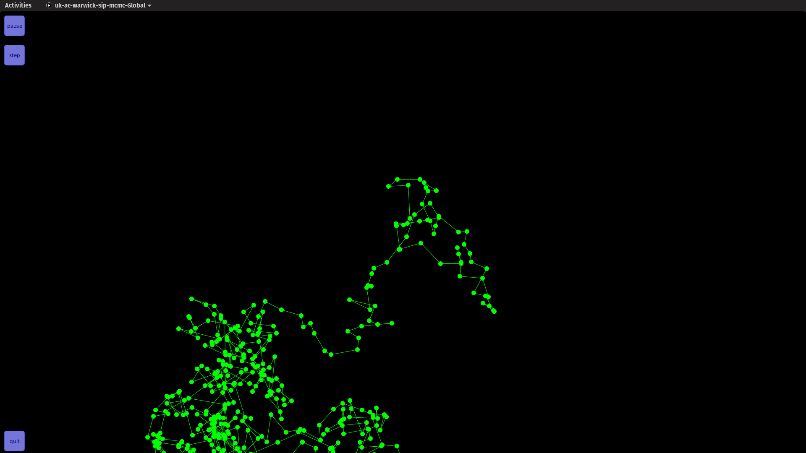
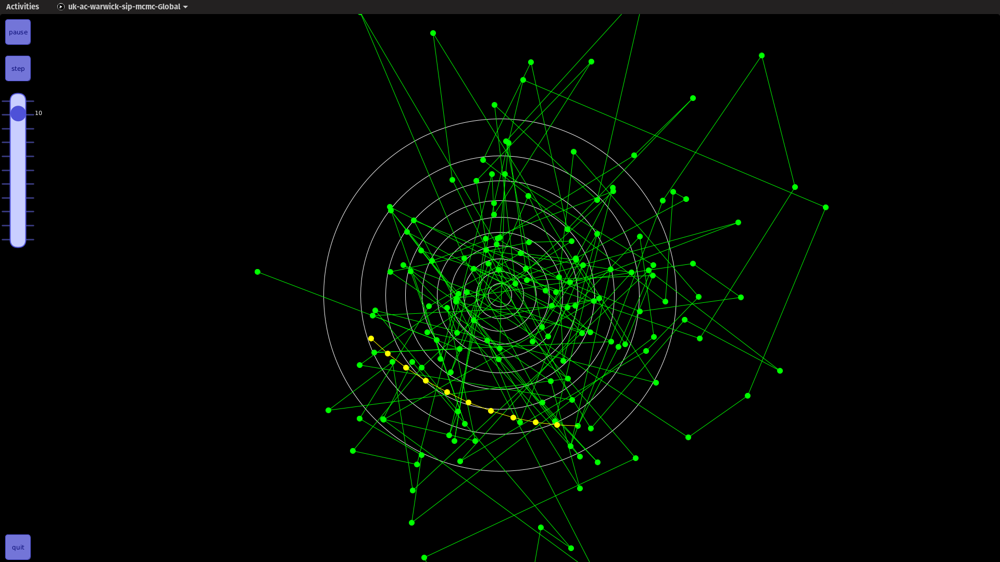
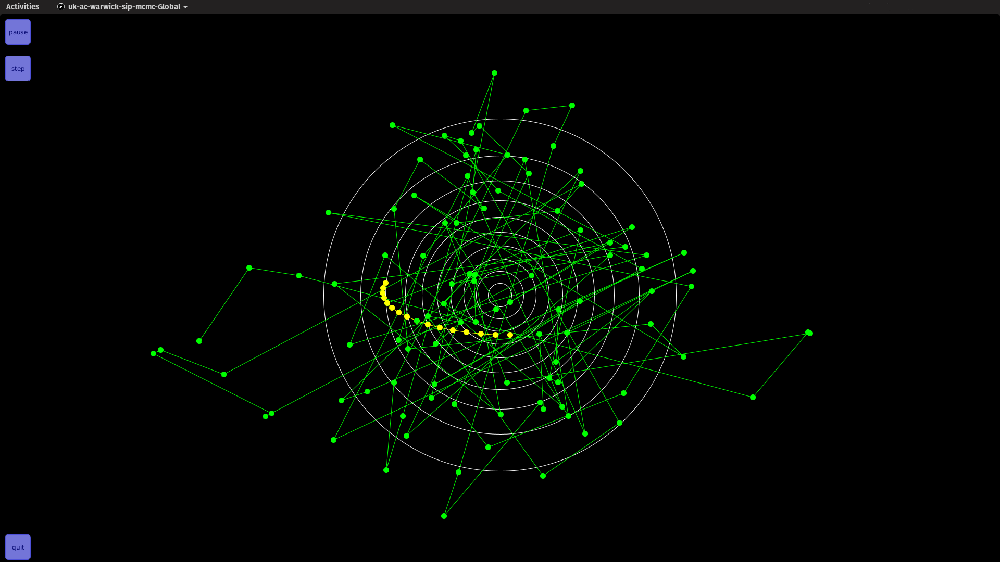
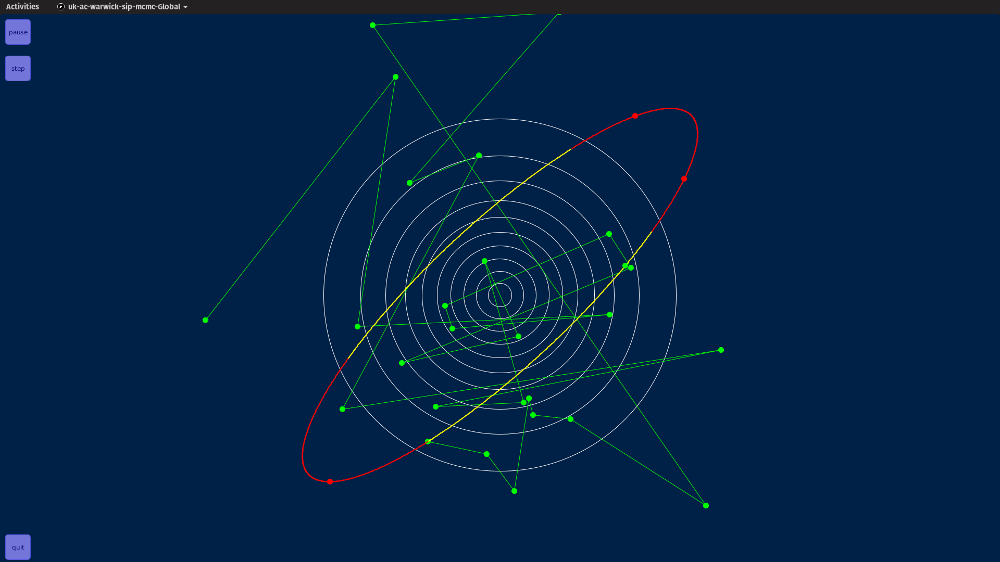

# oxwasp_exchange_mcmc

*Java* implementations of the **Metropolis-Hastings** (Metropolis et al., 1953) (Hastings, 1970), **Adaptive Metropolis-Hastings** (Haario et al., 2001) (Roberts and Rosenthal, 2009), **Hamiltonian Monte Carlo** (Neal, 2011), **No U-Turn Sampler** (Hoffman and Gelman, 2014) including the dual averaging version and **Elliptical Slice Sampler** (Murray et al., 2010).

Also included are *Processing* implementations of the algorithms for visualising these algorithms sampling a 2D Normal distribution.

For dependencies, see the `pom.xml` file or:
* `aliceinnets.python.jyplot.JyPlot` [java-jyplot](https://github.com/aliceinnets/java-jyplot) (which also requires Python with [Matplotlib](https://matplotlib.org/))
* `g4p_controls` [G4P (GUI for processing)](http://www.lagers.org.uk/g4p/) (*version 4.1.5 and the dependent `.jar` is not available on Maven*)
* `processing.core.PApplet` [Processing](https://processing.org/)
* `org.apache.commons.math3` [Commons Math: The Apache Commons Mathematics Library](http://commons.apache.org/proper/commons-math/)
* `org.ejml` [Efficient Java Matrix Library](http://ejml.org/wiki/index.php?title=Main_Page)

## How to use (Linux recommended)
Call the `.jar` file using
```
java -jar oxwasp_exchange_mcmc-1.0.0-jar-with-dependencies.jar -option
```
where `-option` can be one of the following options below. Click on `pause` to pause the simulation, once paused, click on `step` to run the simulation one step at a time. Click on `quit` to quit the simulation.

### `-bm` Brownian Motion
Click on the screen to start a Brownian motion.



### `-rwmh` Random walk Metropolis-Hastings
Click and drag to create a circle, the radius correspond to the proposal distribution. Release to create a random walk Metropolis-Hastings. Green dots represent accepted steps and red dots represent rejected steps. Check on `adaptive` to adapt the proposal distribution.


### `-hmc` Hamiltonian Monte Carlo
Click on the screen to start a Hamiltonian Monte Carlo. The yellow dots show the leap frog steps. Slide the slider to change the number of leap frog steps.




### `-nuts` No U-Turn Sampler
Click on the screen to start a No U-Turn Sampler. The yellow dots show the leap frog steps and the blue dot shows the accepted sample from those leap frog steps.



### `-slice` Elliptical Slice Sampler
Click on the screen to start an elliptical slice sampler. The next step of the chain is searched for on the ellipse. The yellow sections show acceptable regions of the ellipse. The red sections show unacceptable regions of the ellipse. Red dots shows rejected samples.



## How to compile (Linux recommended)
*Maven* required.

Clone this repository.

Download `g4p_controls` [G4P (GUI for processing)](http://www.lagers.org.uk/g4p/) version 4.1.5 and locate `G4P.jar`. Install it using
```
mvn install:install-file -Dfile=./G4P.jar -DartifactId=g4p_controls -DgroupId=g4p_controls -Dversion=4.1.5 -Dpackaging=jar
```

Go to the repository and run
```
mvn package
```
and the `.jar` files are located in `target/`.

## References
* Haario, H., Saksman, E., Tamminen, J., et al. (2001). An adaptive Metropolis algorithm. _Bernoulli_, 7(2):223-242.
* Hastings, W. K. (1970). Monte Carlo sampling methods using Markov chains and their applications. _Biometrika_ 57(1):97-109.
* Hoffman, M. D. and Gelman, A. (2014). The No-U-turn sampler: Adaptively setting path lengths in Hamiltonian Monte Carlo. _Journal of Machine Learning Research_, 15(1):1593-1623.
* Metropolis, N., Rosenbluth, A. W., Rosenbluth, M. N., Teller, A. H., and Teller, E. (1953). Equation of state calculations by fast computing machines. _The Journal of Chemical Physics_, 21(6):1087–1092.
* Murray, I., Adams, R. P., and MacKay, D. J. (2010). Elliptical slice sampling. _In Proceedings of the 13th International Conference on Artificial Intelligence and Statistics_.
* Neal, R. M. (2011). MCMC using Hamiltonian dynamics. In Brooks, S., Gelman, A., Jones, G., and Meng, X.-L., editors, _Handbook of Markov Chain Monte Carlo_, chapter 5, pages 113–162. CRC press.
* Roberts, G. O. and Rosenthal, J. S. (2009). Examples of adaptive MCMC. _Journal of Computational and Graphical Statistics_, 18(2):349–367.
